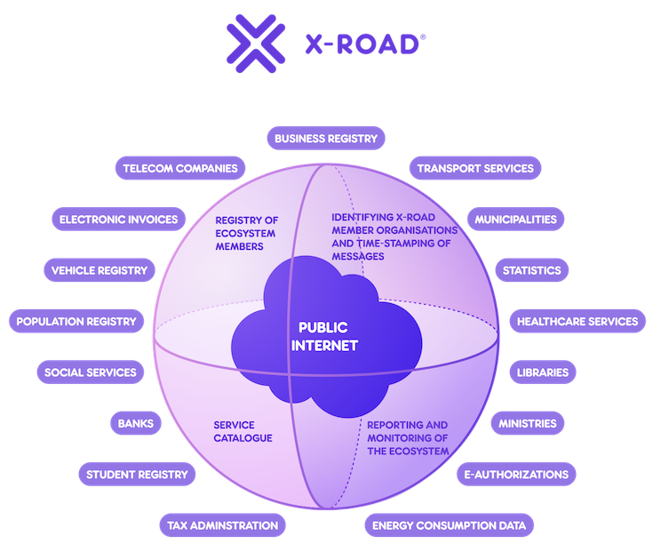

# X-Road Documentation

## What is X-Road

X-Road® is open-source software and ecosystem solution that provides unified and secure data exchange between
organisations.

The X-Road Data Exchange Layer is a standardised, cohesive, collaborative, interoperable and secure data exchange layer
that gives service providers a completely new kind of opportunity of making themselves visible in services directed at
citizens, businesses and civil servants. Creating entities that combine many different services and data sources is
easy and cost efficient.

* Improves the quality of existing services and products
* Enables new types of service innovations
* Savings in infrastructure, archiving and other costs
* Standardised data security and privacy protection
* Easy implementation, data access via interfaces – after connecting all included services are available

See [X-Road product website](https://x-road.global) for more information about X-Road.

For an in-depth look at the X-Road architecture, take a look at the [architecture documents section of the
documentation](doc/Architecture).

## Installing X-Road

Depending on if you are joining an existing X-Road instance or creating a new one, the software packages you need to
install vary quite a bit.

In case you are looking to join an existing instance, be sure to familiarise yourself with the rules and documentation
of the instance before moving on to the installation guides.

If you are looking to set up your own instance, we recommend you visit the [X-Road website](https://x-road.global),
have a look at the [architecture documents](doc/Architecture) on this page as well as familiarising yourself with the 
concepts with the free [X-Road Academy](https://x-road.thinkific.com) courses.

### Security Server

The X-Road Security Server packages are officially available for Ubuntu 20.04, Ubuntu 22.04, RHEL7 and RHEL8.
Additionally we provide docker support with the
[X-Road Security Server Sidecar](https://hub.docker.com/r/niis/xroad-security-server-sidecar).

To learn more about installing the software, please visit the appropriate guide for your operating system of choice:

* [Installation guide for Ubuntu](doc/Manuals/ig-ss_x-road_v6_security_server_installation_guide.md)
* [Installation guide for RHEL](doc/Manuals/ig-ss_x-road_v6_security_server_installation_guide_for_rhel.md)

To learn about setting up a Security Server cluster with an external load balancer, please take a look at the relevant
documentation [here](doc/Manuals/LoadBalancing/ig-xlb_x-road_external_load_balancer_installation_guide.md).

### Central Server

The X-Road Central Server packages are currently only available for Ubuntu 20.04 and Ubuntu 22.04. You can find the
installation manual [here](doc/Manuals/ig-cs_x-road_6_central_server_installation_guide.md).

To learn about setting up a Central Server cluster, please also take a look at the relevant documentation
[here](doc/Manuals/ig-csha_x-road_6_ha_installation_guide.md).
